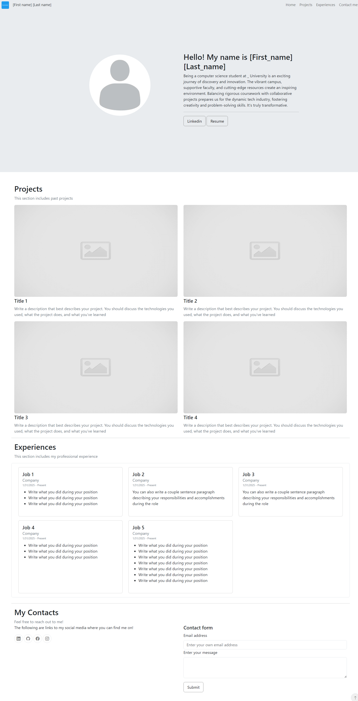

# CV Website Template
Authored by: k3nnee

## Table of contents
- [Introduction](#introduction)
- [Installation](#installation)
- [Issues and bugs](#issues-and-bugs)
- [Contact me](#contact-me)
- [Screenshots](#screenshots)

## Introduction
I created this template to help busy computer science students 
effortlessly showcase their work and skills through a portfolio. 
As a computer science student myself, I understand the 
importance of having an easily customizable and visually appealing 
portfolio. This template is designed to simplify the process of 
building a portfolio, allowing you to focus on what truly matters 
– your projects and achievements.

This is just a basic template to make the process easier, add colors, change formats, make your website
pop!

Features:
- Scroll-to-Top Button: A convenient button located at the bottom right corner of the screen allows users to quickly scroll back to the top of the page.

- Responsive Navbar: The navbar smoothly scrolls to the targeted section of the page, enhancing the navigation experience.

- Project Section Animation: Projects in this section gracefully fade in as they enter the viewport, adding a dynamic touch.

- Experience Section Animation: Experience items load sequentially from left to right, providing an engaging visual flow.

## Installation
1. Fork this repository
2. Run through the HTML files and fill it the blank!

## Issues and bugs
If you run into issues or bugs, you can add an issue within the 
repository or create a PR:)

## Contact me
If you want to contact me, you can reach out to me via Linkedin from the [top](#cv-website-template)!

## Screenshots
